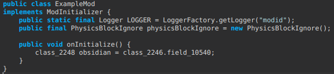
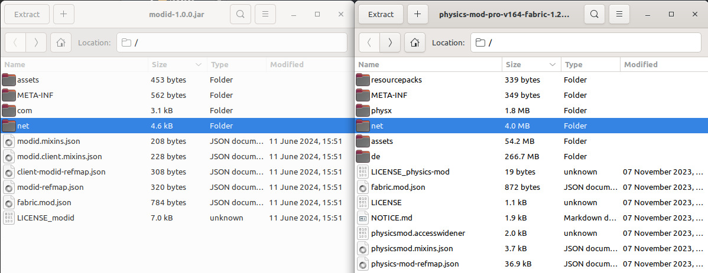

# Modding the Minecraft Physics Mod
### Add a block exclude list to the Physics Mod

[](https://youtu.be/fujp4yJOjpc)

We started playing some Minecraft with the [Physics Mod](https://www.curseforge.com/minecraft/mc-mods/physics-mod). We had a ball playing with this package, however, combined with [Computer Craft Tweaked](https://www.curseforge.com/minecraft/mc-mods/cc-tweaked), we ran into a problem where turtles would simply destroy themselves, not even dropping as an item. This happened when the turtle would dig a block, Physics mod does a search for surrounding blocks and appends the turtle to the block list to potentially destroy, and then it would get destroyed; this still doesn't explain why it wasn't dropping an item, but the problem lay further upstream so I moved my attention to that.

We made contact with some people on the Physics mod discord server, however, it was quite clear that the developers were not interested in helping with pushing an update to add this simple block exclude feature, or releasing the source code. Additionality, we knew it was possible to add this functionality with minimal effort because [Obsidian](https://minecraft.fandom.com/wiki/Obsidian) is not affected by Physics mod.

### The goal
Modify the `.jar` file from Physics mod to include some code that creates a `blocks_to_exclude.json` in the Physics mod config folder.

### Prerequisites
 - [Recaf](https://github.com/Col-E/Recaf) : Java bytecode editor
 - JDK17
 - IDE of your choice (I recommend Intelij for Java, VSCode for everything else)

### A little tip on running frequently used `jar`s
If you use [Fish](https://fishshell.com/), this could be a nice QOL function for you:
```fish
# ~/.config/fish/functions/jarrefresh.fish

set home_dir /home/dude # change this

function jarrefresh -d "Refresh jars"
    set func_dir ./jar_funcs
    if test -d $func_dir
        rm -r $func_dir
    end
    mkdir $func_dir

    for jar in $home_dir/jars/*.jar;
        set jar_name (basename $jar | sed 's/\.jar//')
        echo > $func_dir/$jar_name'.fish' "\
function $jar_name -d 'Execute $jar_name'
    java -jar $jar \$argv
end
        "
    end
end
```
```fish
# ~/.config/fish/config.fish
set fish_function_path \
    ~/.config/fish/functions/*/ \
    $fish_function_path
```
1) Add functions above to config
2) Now make a folder in your home directory `~/jars`
3) Put your `jar` files in that folder, such as `recaf.jar`
4) Run `jarrefresh` in your Fish console
5) Start a new console session
6) Run `recaf` from anywhere!

### Outline of the steps
1) Setup your own [Fabric Mod](https://github.com/FabricMC/fabric-example-mod)
2) Get your desired `jar` for Physics mod (I used the pro version for waves - free on their Patreon btw). This uses `1.20.1`
3) Create a class which loads a json for blocks to exclude
4) Create a function which checks if a given block is part of that list (we create own own mod because Minecraft has obfuscated function names which need to match the Physics mod version)
4) Find relevant class in Physics mod
6) Modify the Physics mod class to:
   1) Instansiate our class on startup
   2) Call our function everytime a block should be destroyed (should be near the Obsidian block check)
7) Program turtles in peace :-)

### Getting your mod setup
 - Make a folder `mods` inside the root directory of your gradle project
 - Run the gradle `runClient` task

### Our code
*I am not a Java programmer and I hate writing it, so don't judge.*

**Modify your initialization function for a sanity check**.
```java
// src/main/java/com/example/ExampleMod.java
@Override
public void onInitialize() {
    // This code runs as soon as Minecraft is in a mod-load-ready state.
    // However, some things (like resources) may still be uninitialized.
    // Proceed with mild caution.

    LOGGER.info("Hello Fabric world!");
    
    // NEW CODE
    String block = Blocks.OBSIDIAN.getTranslationKey();
    LOGGER.info("TEST BLOCK: " + block);
}
```
When you run your client and `ctrl+f` for `TEST BLOCK:` you should see: `[15:34:10] [Render thread/INFO] (modid) TEST BLOCK: block.minecraft.obsidian`

**Add the following file/class** (I told you I don't like java, didn't I?)
```java
// src/main/java/net/chads/extensions/PhysicsBlockIgnore.java
package net.chads.extensions;

import com.google.gson.JsonArray;
import com.google.gson.JsonElement;
import com.google.gson.JsonObject;

import java.io.FileReader;
import java.io.FileWriter;
import java.io.IOException;
import java.util.ArrayList;
import com.google.gson.Gson;
import net.minecraft.block.Block;
import net.minecraft.block.BlockState;

public final class PhysicsBlockIgnore
{
    private final ArrayList<String> blocksToIgnore;

    public PhysicsBlockIgnore() {
        blocksToIgnore = new ArrayList<>();
    }

    public PhysicsBlockIgnore(String configDir) {
        blocksToIgnore = loadBlocksToIgnore(configDir);
    }

    private static ArrayList<String> loadBlocksToIgnore(String configDir) {
        // File path
        String key = "ignore_if_starts_with";
        final String blocksToIgnoreFP = configDir + "/blocks_to_ignore.json";
        System.out.println("Loading blocks to ignore from " + blocksToIgnoreFP);
        try (FileReader reader = new FileReader(blocksToIgnoreFP)) {
            JsonObject jsonObject = new Gson().fromJson(reader, JsonObject.class);
            System.out.println("Loaded blocks to ignore from " + blocksToIgnoreFP);

            // Check if the file has the blocks_to_ignore key
            if (jsonObject.has(key)) {
                ArrayList<String> blocksToIgnore = new ArrayList<>();
                System.out.println("Found blocks to ignore in " + blocksToIgnoreFP + ":");

                JsonArray blocksArray = jsonObject.getAsJsonArray(key);
                for (JsonElement block : blocksArray) {
                    String blockName = block.getAsString();
                    System.out.println("\t> " + blockName);
                    blocksToIgnore.add(blockName);
                }

                return blocksToIgnore;
            } else {
                System.out.println("No blocks to ignore found in " + blocksToIgnoreFP);
            }
        } catch (IOException e) {
            // make a new file
            String defaultJson = "{\n" +
                    "  \"ignore_if_starts_with\": [\n" +
                    "    \"block.computercraft\"\n" +
                    "  ]\n" +
                    "}";
            try (FileWriter file = new FileWriter(blocksToIgnoreFP)) {
                file.write(defaultJson);
                System.out.println("Wrote default blocks to ignore to " + blocksToIgnoreFP);
            } catch (IOException ex) {
                System.out.println("Failed to write default blocks to ignore to " + blocksToIgnoreFP);
                ex.printStackTrace();
            }
        }

        ArrayList<String> blocksToIgnore = new ArrayList<>();
        blocksToIgnore.add("block.computercraft");
        return blocksToIgnore;
    }

    public boolean shouldIgnoreBlock(Block block) {
        for (String blockName : blocksToIgnore) {
            String mcBlockName = block.getTranslationKey();
            if (mcBlockName.startsWith(blockName)) {
                return true;
            }
        }
        return false;
    }

    public boolean shouldIgnoreBlockState(BlockState blockState) {
        return shouldIgnoreBlock(blockState.getBlock());
    }

    public boolean test() {
        return true;
    }

    public static boolean staticTest() {
        return true;
    }
}
```

**Modify your `ExampleMod` class to instantiate the `PhysicsBlockIgnore` class.** We need to this to extract some bytecode later.

```java
// src/main/java/com/example/ExampleMod.java
public class ExampleMod implements ModInitializer {
    public static final Logger LOGGER = LoggerFactory.getLogger("modid");
    public final PhysicsBlockIgnore physicsBlockIgnore;

    public ExampleMod() {
        this.physicsBlockIgnore = new PhysicsBlockIgnore();
    }

    @Override
    public void onInitialize() {
    }
}
```
Verify that it runs. We are about to enter a much more difficult debugging environment.

**Build the jar using gradle and move it to a new directory.** You can find the output at `build/libs/modid-1.0.0.jar`

### Moving it to the actual Physics mod
I am now working in a clean directory `modified`.

**Save your Physics mod version here.**

My `modified` directory looks like (it just helps in keeping your sanity):
```
./modified
├── modid-1.0.0.jar
└── physics-mod-pro-v164-fabric-1.20.1.jar
```

**Open Recaf. Load `modid-1.0.0.jar`**

Take a moment to familiarise yourself with the program; it is an incredible piece of software!

**Open the `ExampleMod` class.**

**Select `Edit with assembler` as shown in the screenshot below.**


Copy that value an keep it handy: `DEFINE PUBLIC FINAL Lnet/chads/extensions/PhysicsBlockIgnore; physicsBlockIgnore`. You could probably just define it based on the syntax once you've seen it a few times, but we're going from scratch.

***Note:*** at this point you can see why we had to go about making our own mod:


**Open Physics mod in Recaf**
We need to find the class that is responsible for doing the obsidian block check. I'll help you out and hint at *cough*, *cough* *`classes/net/diebuddies/physics/ServerPhysicsMod.java`*:

```java
// Decompiled with: CFR 0.152
// Class Version: 17
package net.diebuddies.physics;

import it.unimi.dsi.fastutil.objects.ObjectArrayList;
import it.unimi.dsi.fastutil.objects.ObjectOpenHashSet;
import java.util.Iterator;
import java.util.List;
import java.util.Map;
import java.util.concurrent.ConcurrentHashMap;
import net.diebuddies.bridge.FabricAPIServer;
import net.diebuddies.config.ConfigServer;
import net.diebuddies.physics.FallingBlocks;
import net.minecraft.class_1657;
import net.minecraft.class_1937;
import net.minecraft.class_2246;
import net.minecraft.class_2248;
import net.minecraft.class_2338;
import net.minecraft.class_2586;
import net.minecraft.class_2680;
import net.minecraft.class_3218;
import org.joml.Vector3i;
import org.joml.Vector3ic;

public class ServerPhysicsMod
implements FabricAPIServer.StartWorldTick,
FabricAPIServer.After {
    private Map<class_1937, List<FallingBlocks>> fallingBlocks = new ConcurrentHashMap<class_1937, List<FallingBlocks>>();

    public ServerPhysicsMod() {
        ConfigServer.init();
    }

    private boolean canFall(class_1937 level, class_2338 pos, class_2680 b) {
        if (b.method_26204() != class_2246.field_10540 && b.method_26204() != class_2246.field_9987 && b.method_26204() != class_2246.field_10316 && b.method_26204() != class_2246.field_10027 && b.method_26204() != class_2246.field_10398 && !b.method_26215() && b.method_26204() != class_2246.field_10382 && b.method_26204() != class_2246.field_10164) {
            class_2680 toCheck = level.method_8320(pos.method_10074());
            class_2248 block = toCheck.method_26204();
            if (toCheck.method_26215() || block == class_2246.field_10382 || block == class_2246.field_10164 || block == class_2246.field_10343) {
                return true;
            }
        }
        return false;
    }

    @Override
    public void afterBlockBreak(class_1937 level, class_1657 player, class_2338 pos, class_2680 state, class_2586 blockEntity) {
        if (!ConfigServer.collapse) {
            return;
        }
        this.checkAdjacentBlocks(level, player, pos.method_10263(), pos.method_10264(), pos.method_10260());
    }

    @Override
    public void onStartTick(class_3218 level) {
        List blocks = this.fallingBlocks.computeIfAbsent((class_1937)level, key -> new ObjectArrayList());
        Iterator it = blocks.iterator();
        while (it.hasNext()) {
            FallingBlocks falling = (FallingBlocks)it.next();
            if (ConfigServer.collapseSpeed == 0 || falling.ticks % ConfigServer.collapseSpeed == 0) {
                Vector3i tmp = new Vector3i();
                boolean end = false;
                do {
                    ObjectOpenHashSet toCheck = new ObjectOpenHashSet();
                    for (Vector3i check : falling.toCheck) {
                        for (int y = -1; y <= 1; ++y) {
                            for (int x = -1; x <= 1; ++x) {
                                for (int z = -1; z <= 1; ++z) {
                                    if (x == 0 && y == 0 && z == 0) continue;
                                    tmp.set(check.x + x, check.y + y, check.z + z);
                                    if (falling.alreadyChecked.contains(tmp)) continue;
                                    class_2338 blockPos = new class_2338(check.x + x, check.y + y, check.z + z);
                                    class_2680 b = falling.level.method_8320(blockPos);
                                    falling.alreadyChecked.add(new Vector3i((Vector3ic)tmp));
                                    if (!this.canFall(falling.level, blockPos, b)) continue;
                                    if (ConfigServer.dropBlocks) {
                                        class_2680 state = falling.level.method_8320(blockPos);
                                        class_2586 te = falling.level.method_8321(blockPos);
                                        state.method_26204().method_9556(falling.level, falling.player, blockPos, state, te, falling.player.method_6030());
                                    }
                                    falling.level.method_8501(blockPos, class_2246.field_10124.method_9564());
                                    falling.fallen.add(new Vector3i((Vector3ic)tmp));
                                    toCheck.add(new Vector3i((Vector3ic)tmp));
                                }
                            }
                        }
                        if (falling.fallen.size() <= ConfigServer.maxCollapseObjects) continue;
                        end = true;
                        it.remove();
                        break;
                    }
                    falling.toCheck = toCheck;
                    if (falling.toCheck.size() != 0) continue;
                    end = true;
                    it.remove();
                } while (ConfigServer.collapseSpeed == 0 && !end);
            }
            ++falling.ticks;
        }
    }

    private void checkAdjacentBlocks(class_1937 level, class_1657 player, int bx, int by, int bz) {
        FallingBlocks falling = new FallingBlocks(level, player);
        falling.toCheck.add(new Vector3i(bx, by, bz));
        List blocks = this.fallingBlocks.computeIfAbsent(level, key -> new ObjectArrayList());
        blocks.add(falling);
    }
}
```

If you take a moment to look at the logic and not-obfuscated variables/functions, you'll begin to see what this is doing. The deeply nested loop inside `onStartTick` runs on every server tick (usually 20 ticks per second; TPS). Here, we look at every block in the `fallingBlocks` list, and search the Minecraft world around it (i.e. `x`, `y` and `z`). There are some optimizations that I'm unsure of whether the Java runtime would pick up, but let's gloss over that.

The `canFall` function has a long, chained `if` statement which checks what looks like blocks (tracing back from the caller, `onStartTick` inside the loop).


I actually had to resize Recaf across two screens to take that. *'bruh*

To check my suspicion with the Obsidian block, let's go back to our own mod, create variable inside the `ExampleMod` initializer, instantiating an Obsidian block, and see if the obfuscated name matches with any of the ones in the if block.



Sure enough, `field_10540` is the first comparison in the massive if block!


This looks like a good place to put our code.

### Modifying the `jar` file.

To recap, the modifications we need to make here are:
 - Move our `net` currently found inside `modid-1.0.0.jar` to `physicsmod...jar`
 - Instansiate our own class, `PhysicsBlockIgnore` inside `ServerPhysicsMod`
 - Call our function `shouldIgnoreBlockState` inside `canFall` (I figured out the `b` parameter is a state, not block)

#### Moving our code to Physics mod

I would recommend making a copy of your Physics mod `jar` at this point.

Go ahead and open both your `modid-1.0.0.jar` and `physicsmod.jar` in an archive manager. Personally, I'm using the default Linux Mint Archive Manager, but something like 7zip should work just fine.



*Note: I don't know why dark theme isn't working but alas, it's a Linux thing*

Now just drag and drop. It's that simple. A `jar` file is more or less just a wrapper around `zip` files with a specific format for the file directory; this is why we can use a standard archive manager to modify the contents. Feel free to take a look at the class files - you'll see they're most certainly still binary files.

Verify that your drag and drop did actaully add the `chads` directory inside the `net` folder.

#### Instansiating our class
Remember that thing I said to keep handy earlier?

 `DEFINE PUBLIC FINAL Lnet/chads/extensions/PhysicsBlockIgnore; physicsBlockIgnore`

Let's add that inside `ServerPhysicsMod`


Hit save (`ctrl+s`). ***WOAAAAAAA***


Congratulations, you just made your first modification!

*Notice: Recaf already added an import on `line 11` for me:*


**Now, it's time to modify the constructor.**

Right click on the file name at the top, `Class mode -> Table`, under `Methods`, right click the `<init>` function, `Edit with assembler`


Add the following line at the end of the constructor:


`EXPR physicsBlockIgnore = new net.chads.extensions.PhysicsBlockIgnore("config/physicsmod");`

Can we just take a moment to appreciate the beauty of this tool, Recaf? The `EXPR` instruction makes this a breeze.

*Note: I had to use a fully qualified path for the class even though it has already been "imported". Maybe this is because the changes haven't actually been saved to the `jar` yet.*


#### Calling our function

This is a similar story to modifying the constructor. Instead we will just use `EXPR if (physicsBlockIgnore.shouldIgnoreBlockState(b)) { return false; }`. I put this above the `ALOAD b` bytecode instruction.


### Export your Recaf program

`File -> Export program`

### Testing it out

We use [MultiMC](https://multimc.org/), another amazing open-source tool to manage your Minecraft instances.

Chuck in the jar along with CC Tweaked. After opening for the first time, and looking inside your `.minecraft/config/physicsmod` folder, if you see a new file named `blocks_to_ignore.json`, there's a good chance everything worked out!


Open up a MC world, place a turtle on the ground, and observe that it doesn't get destroyed when you break blocks underneath it.

This can easily be extended to other mod packs/blocks by modifying the json. For example, we use the [Building But Better](https://www.curseforge.com/minecraft/mc-mods/building-but-better) mod, for apparant reasons, and in order to prevent the havok the ensues when you destroy a single block and half of your base collapseses, we added `blocks.bbb` to the json.

### A note on `jar` files:

Don't use Java :-()